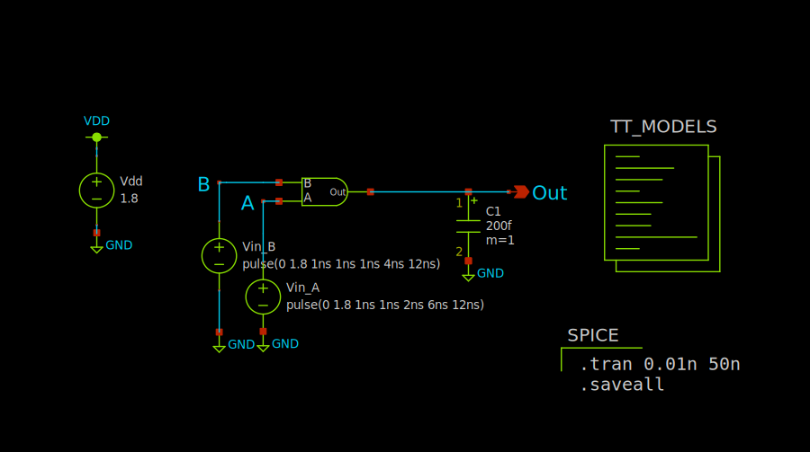

# MiniProject 1 Report
Max Stopyra

[Github Repo with all pertinent files](https://github.com/mstopyra/MADVLSI_FA23)

### Inverter Schematic:

### 2-input NAND Gate Schematic:

### Test Harness Schematic:

### Transient simulation results:

### Top-Level Cell Layout:

### LVS Output:
Circuit 1 cell sky130_fd_pr__nfet_01v8 and Circuit 2 cell sky130_fd_pr__nfet_01v8 are black boxes.
Equate elements:  no current cell.
Device classes sky130_fd_pr__nfet_01v8 and sky130_fd_pr__nfet_01v8 are equivalent.

Circuit 1 cell sky130_fd_pr__pfet_01v8 and Circuit 2 cell sky130_fd_pr__pfet_01v8 are black boxes.
Equate elements:  no current cell.
Device classes sky130_fd_pr__pfet_01v8 and sky130_fd_pr__pfet_01v8 are equivalent.
Flattening unmatched subcell inverter in circuit AND2.spice (0)(1 instance)
Flattening unmatched subcell NAND2 in circuit AND2.spice (0)(1 instance)
Flattening unmatched subcell NAND_mp1 in circuit AND_MP1_xscheme.spice (1)(1 instance)
Flattening unmatched subcell INV_mp1 in circuit AND_MP1_xscheme.spice (1)(1 instance)

Subcircuit summary:
Circuit 1: AND2.spice                      |Circuit 2: AND_MP1_xscheme.spice           
-------------------------------------------|-------------------------------------------
sky130_fd_pr__nfet_01v8 (3)                |sky130_fd_pr__nfet_01v8 (3)                
sky130_fd_pr__pfet_01v8 (3)                |sky130_fd_pr__pfet_01v8 (3)                
Number of devices: 6                       |Number of devices: 6                       
Number of nets: 7                          |Number of nets: 7                          
---------------------------------------------------------------------------------------
Netlists match uniquely.
Cells have no pins;  pin matching not needed.
Device classes AND2.spice and AND_MP1_xscheme.spice are equivalent.

Final result: Circuits match uniquely.
.
