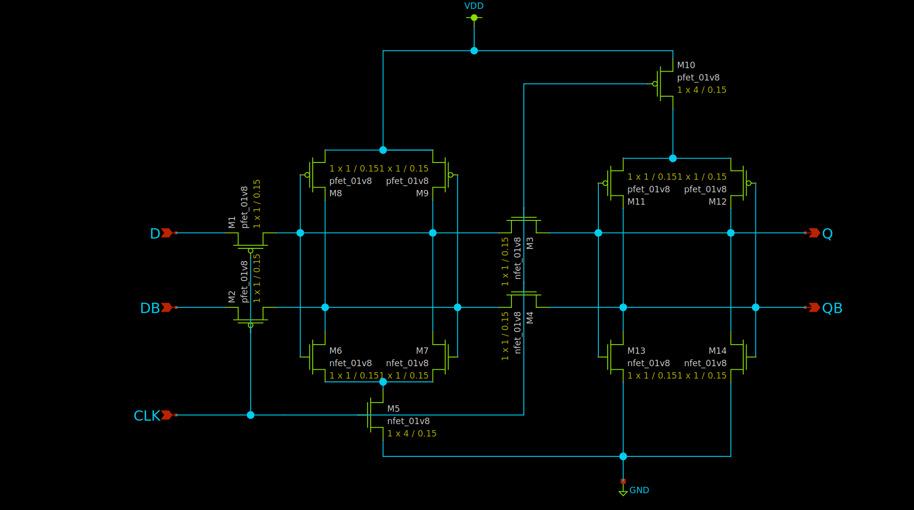
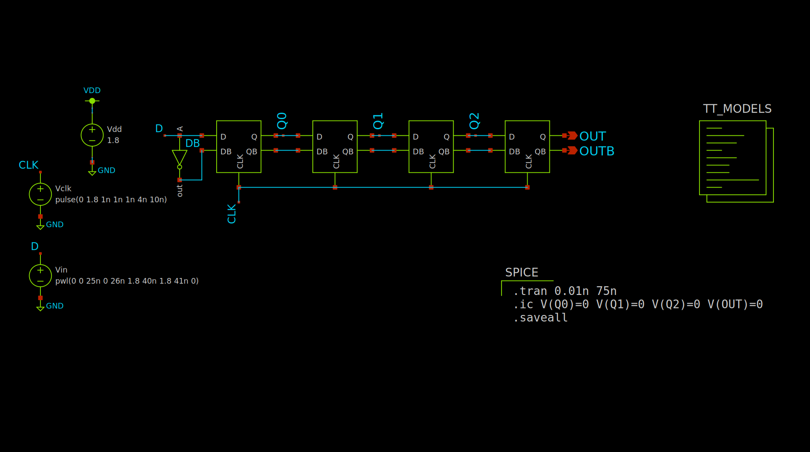
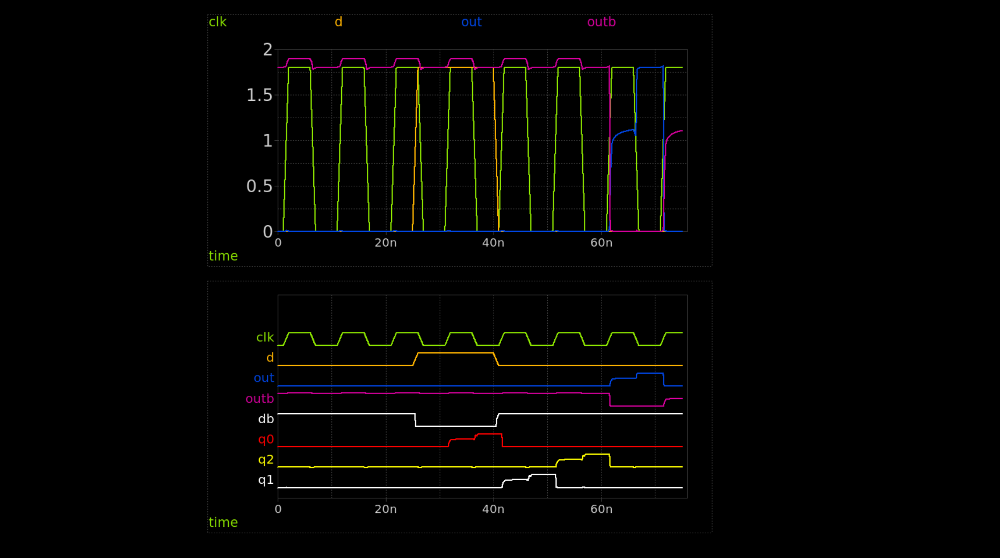
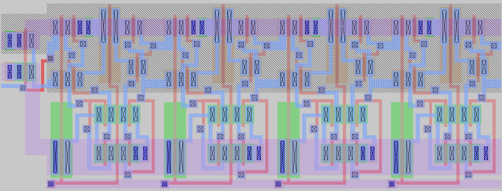
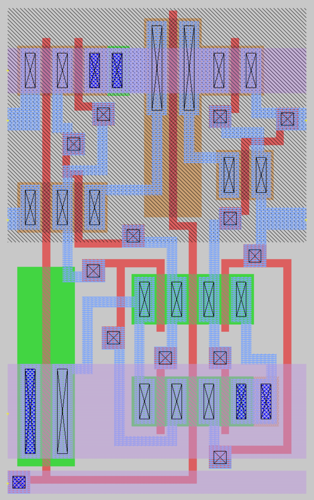

# MiniProject 2 Report
Max Stopyra

[Github Repo with all pertinent files](https://github.com/mstopyra/MADVLSI_FA23/MP2)

### Transistor-Level Edge Sensitive D-flip-flop Schematic:

### 4-bit Shift Register Test Harness Schematic:

### Transient simulation results:

### Top-Level Cell Layout of 4-bit Shift Register: 
26.4 x 9.75 micron cell

### D-flip-flop Cell Layout:

### LVS Output:
Circuit 1 cell sky130_fd_pr__pfet_01v8 and Circuit 2 cell sky130_fd_pr__pfet_01v8 are black boxes.
Equate elements:  no current cell.
Device classes sky130_fd_pr__pfet_01v8 and sky130_fd_pr__pfet_01v8 are equivalent.

Circuit 1 cell sky130_fd_pr__nfet_01v8 and Circuit 2 cell sky130_fd_pr__nfet_01v8 are black boxes.
Equate elements:  no current cell.
Device classes sky130_fd_pr__nfet_01v8 and sky130_fd_pr__nfet_01v8 are equivalent.

Subcircuit summary:
Circuit 1: DFF.spice                       |Circuit 2: CSR_DFF.spice                   
-------------------------------------------|-------------------------------------------
sky130_fd_pr__pfet_01v8 (7)                |sky130_fd_pr__pfet_01v8 (7)                
sky130_fd_pr__nfet_01v8 (7)                |sky130_fd_pr__nfet_01v8 (7)                
Number of devices: 14                      |Number of devices: 14                      
Number of nets: 11                         |Number of nets: 11                         
---------------------------------------------------------------------------------------
Resolving symmetries by property value.
Resolving symmetries by pin name.
Netlists match uniquely.
Cells have no pins;  pin matching not needed.
Device classes DFF.spice and CSR_DFF.spice are equivalent.

Final result: Circuits match uniquely.
.
