# MiniProject 3 Report
Max Stopyra

[Github Repo with all pertinent files]([https://github.com/mstopyra/MADVLSI_FA23/MP3](https://github.com/mstopyra/MADVLSI_FA23/tree/main/MP3))

### Transistor-Level Folded Cascode Differential Amplifier:

#### Inverting vs Non-inverting Input: 
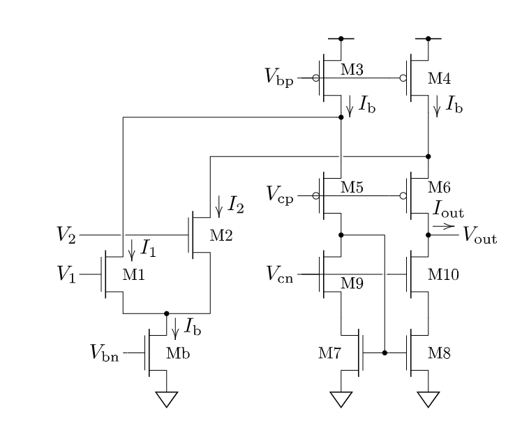
*Figure 1*

 Given the above schematic, one can determine that the gate of M1 is the non-inverting input and the gate of M2 is the inverting input. 

We can determine the non-inverting input by analyzing the circuit using KCL at I1 which states that I1 = Ib - I2
- As V1 goes high, I1 increases, decreasing the current through M5, M7, and M9. Thus, decreasing the current through the current mirror (M7 and M8) and increasing the current flowing to Iout.

We can determine the inverting input by analyzing the circuit using KCL at I2 which states that I2 = Ib - I1.
- When V2 goes high, I2 increases, decreasing the current through M6, M10, and M8. This in turn decreases the current through the current mirror, causing all of Ib to be sent through I2. Thus, Iout decreases. 

#### Common-mode Input Voltage Range of Figure 1:

Under the assumption that we are analyzing the circuit when the current above Mb is equal to the current below Mb we can compress M1 and M2 together into Mcm, and analyze the circuit comprised of Mb and Mcm as a source-follower. Using the EKV model, the knowlege that Mb must always be in saturation, and the fact that when Vcm=Vdd the circuit breaks, we can determine the following:

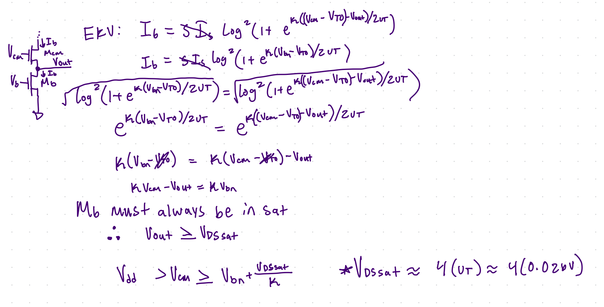

#### If the output voltage were fixed by a voltage source somewhere in the middle of the rails, what would be the output current in terms of I1 and I2 if the Early effect were negligible?

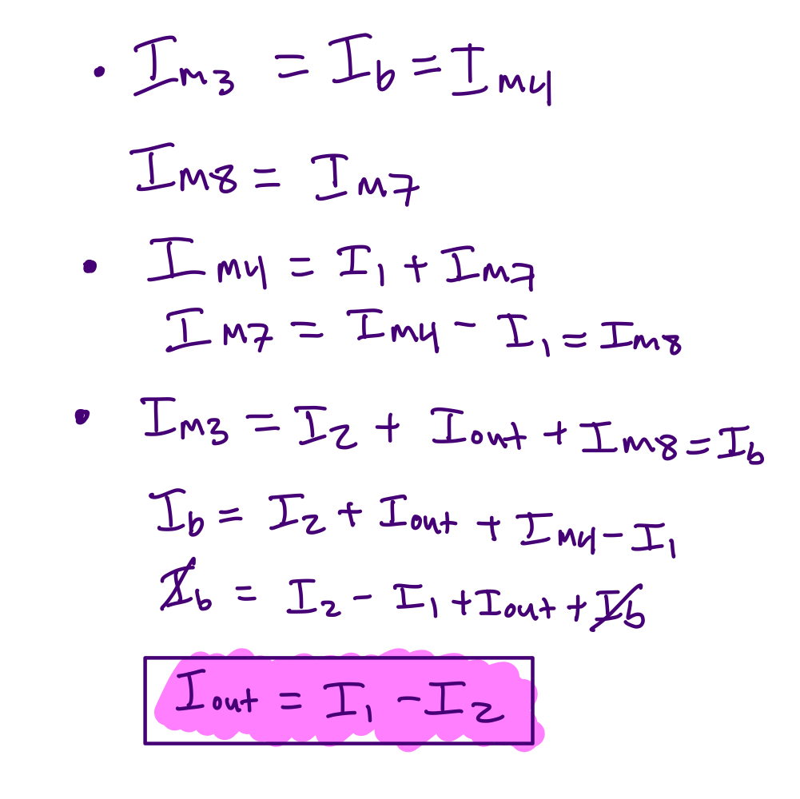

#### Do we need to make the bias current sourced by M3 and M4 equal to the diff-pair bias current, Ib? If so, explain why. If not, what constraints exist on this current level with respect to Ib?

No, there is no need to make the current sourced by M3 and M4, Ibt equal to the diff-pair bias current, Ib. When these two values are equal, Ibt is at the minimum value it can be at for the circuit to still operate (Ibt>=Ib for all cascoding transistors to stay in saturation). If Ibt is larger than Ib, the excess current from Ibt would just be sent through the cascoding pairs, throwing them further into saturation. 

### Bias Circuit for Our FCDA:
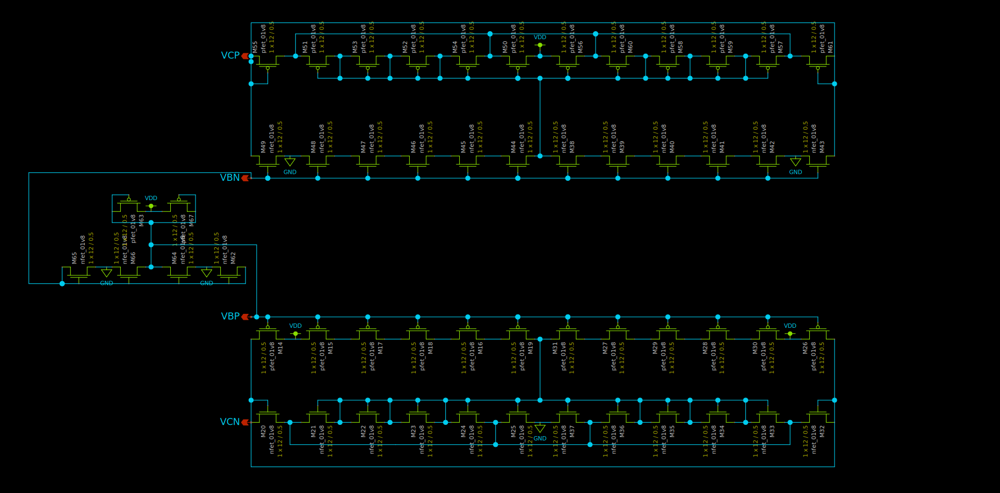

### FCDA Schematic:
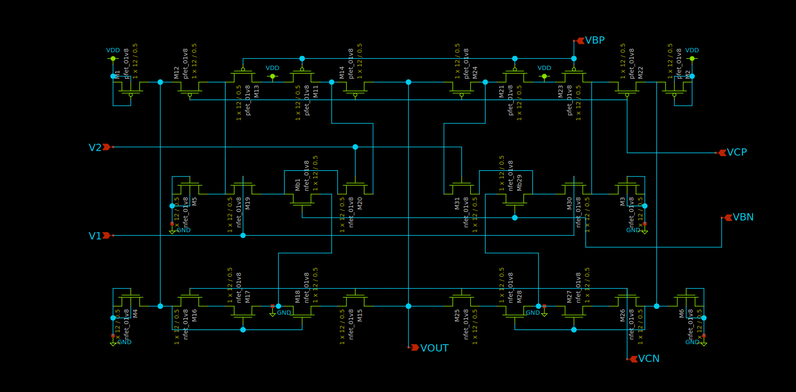

### Top-level Test Harness:
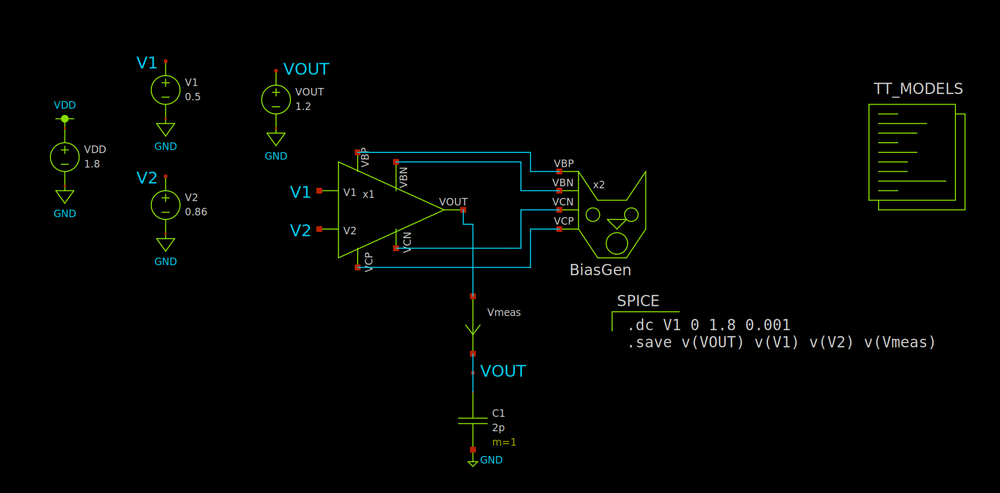

### Voltage Transfer Characteristics of the Circuit:
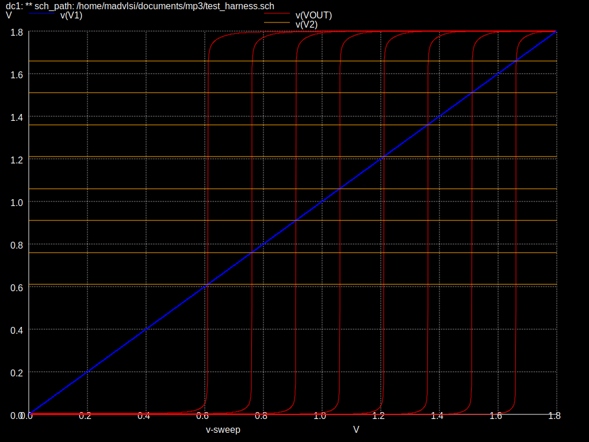

DC Gain from the slope of various VTCs of the circuit:
- V2 @ 0.61v - DC gain of 1116.96
- V2 @ 0.86v - DC gain of 1154.69
- V2 @ 1.11v - DC gain of 1176.58
- V2 @ 1.36v - DC gain of 1187.19
- V2 @ 1.69v - DC gain of 1154.99

### Current Output of the Circuit:
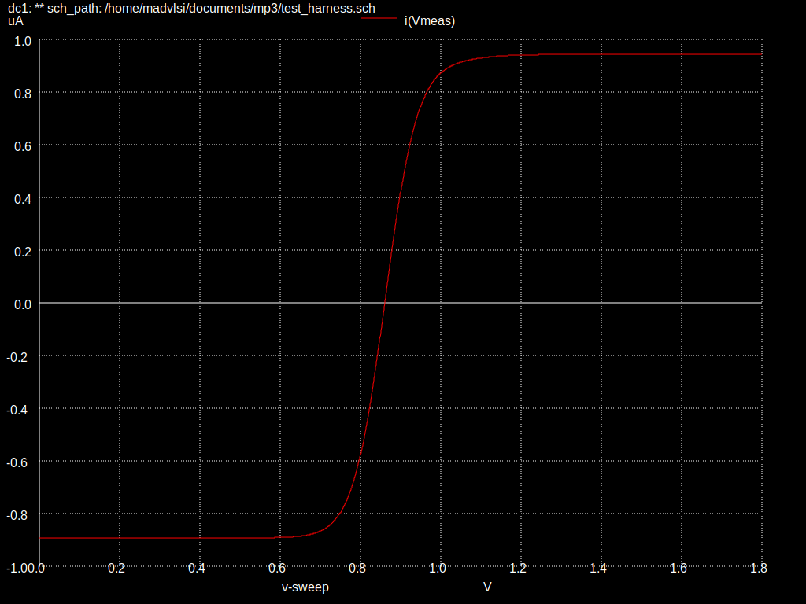

In this test we determined that the incremental transconductance gain of the circuit is 1155.02 when V2 is held at 0.86v. This is consistant with our previous results using our VTC at 0.86v. 

From our graph, we can also determine that the output current limits itself to |Ib|, which is 1uA. 

### Loopgain Simulations
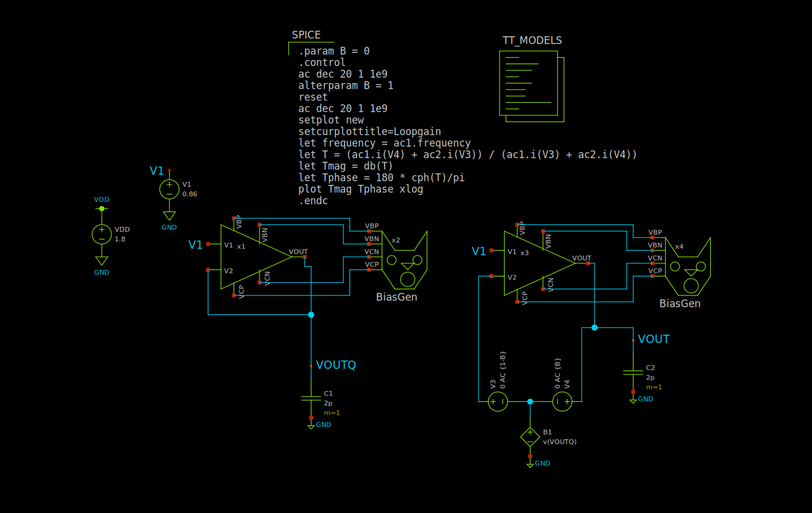

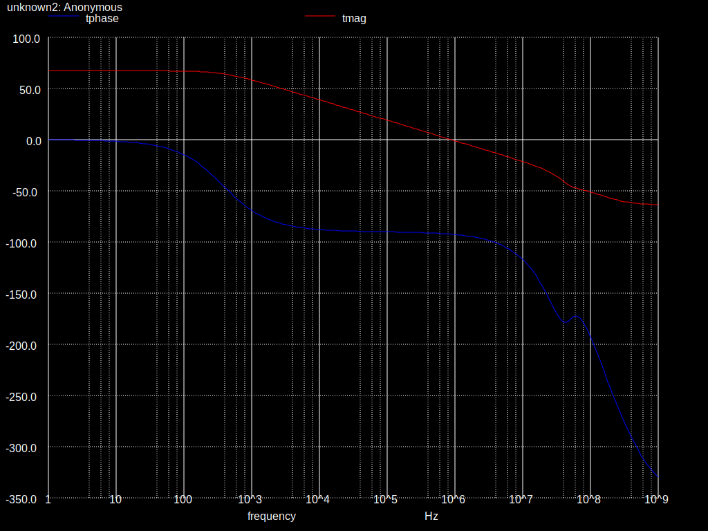

Looking at the simulation results, we can see that the unity gain crossover frequency is around 915 kHz, and that our low frequency gain is 62.47 dB, which is very close to the value we obtained in our VTC, 61.25 dB, and the value we got from measuring our incremental transconductance gain (61.25 dB). 

### Top-level layout: 
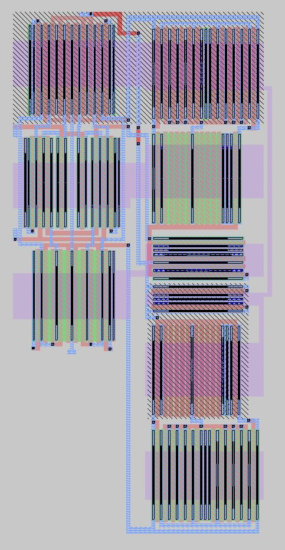

### Bias Circuit layout: 
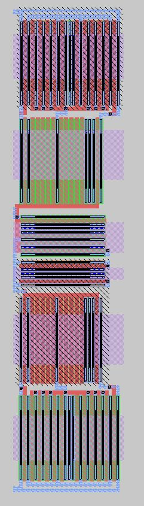

### FCDA layout: 
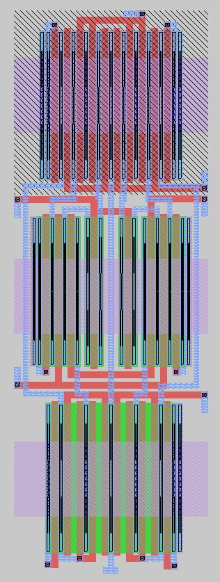

### LVS Output:

Circuit 1 cell sky130_fd_pr__nfet_01v8 and Circuit 2 cell sky130_fd_pr__nfet_01v8 are black boxes.
Equate elements:  no current cell.
Device classes sky130_fd_pr__nfet_01v8 and sky130_fd_pr__nfet_01v8 are equivalent.

Circuit 1 cell sky130_fd_pr__pfet_01v8 and Circuit 2 cell sky130_fd_pr__pfet_01v8 are black boxes.
Equate elements:  no current cell.
Device classes sky130_fd_pr__pfet_01v8 and sky130_fd_pr__pfet_01v8 are equivalent.
Flattening unmatched subcell biasgen in circuit OPAMP_MP3.spice (0)(1 instance)
Flattening unmatched subcell FCDA in circuit OPAMP_MP3.spice (0)(1 instance)

Class OPAMP_MP3.spice (0):  Merged 21 parallel devices.
Class LVS_Circuit.spice (1):  Merged 21 parallel devices.
Subcircuit summary:
Circuit 1: OPAMP_MP3.spice                 |Circuit 2: LVS_Circuit.spice               
-------------------------------------------|-------------------------------------------
sky130_fd_pr__nfet_01v8 (46->35)           |sky130_fd_pr__nfet_01v8 (46->35)           
sky130_fd_pr__pfet_01v8 (36->26)           |sky130_fd_pr__pfet_01v8 (36->26)           
Number of devices: 61                      |Number of devices: 61                      
Number of nets: 41                         |Number of nets: 41                         
---------------------------------------------------------------------------------------
Resolving symmetries by property value.
Resolving symmetries by pin name.
Netlists match with 38 symmetries.
Cells have no pins;  pin matching not needed.
Device classes OPAMP_MP3.spice and LVS_Circuit.spice are equivalent.

Final result: Circuits match uniquely.
.
